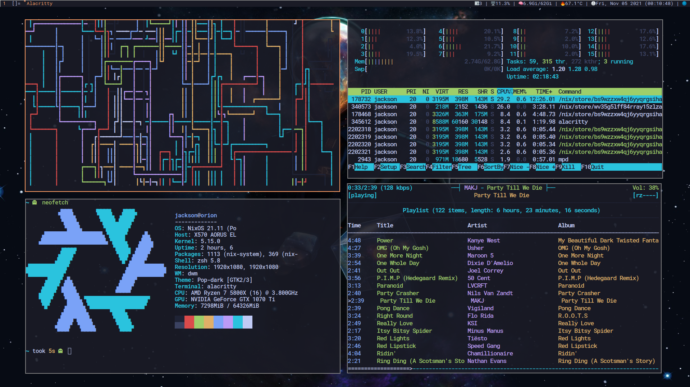

# ❄️ NixOS dotfiles
*My configurating files for NixOS. Please feel free to look around and copy anything you want!*



# Installation
**Note: I use ZFS as a root filesystem so this guide will be targeting how to install my NixOS desktop on top of ZFS on root with compression.**

My system consists of:
 - The latest Linux kernel
 - Nix flakes for ease of installation
 - Nixpkgs unstable for bleeding edge software similar to archlinux or gentoo
 - Dwm, dwmblocks, alacritty, firefox, and neovim are all configured out-of-the-box

## Prerequisites
This guide assumes an installation on an EFI system and only a single root disk, so no RAIDZ.

## Determining the disk
We must first start by assigning the disk id to a variable. This is not required to complete the installation, but it is **highly** recommended.
```bash
DISK=/dev/disk/by-id/<disk>
```

## Partitioning
As we are installing on an EFI system we need at least two partition, recommended are two partitions:

- EFI boot partition
- Root disk

Delete all existing partitions from the root disk, if any exist. Then create the EFI partition (Fdisk type: 1, recommended size 512MB), and the root disk (Fdisk type: 20, remaining disk space).

## Create the filesystem
### Create the root zpool

Create the pool and set all default dataset options. All dataset created on the zpool will inherit of each -O set at the zpool creation.

| Option | Description |
| ------ | ----------- |
| ashift=12 | Set the power of 2 that your block sector is, 12 is 4096 bytes or 2^12 |
| acltype=posixacl | Enables POSIX ACLs globally. |
| relatime=on | Middle ground between classic POSIX atime behavior and atime=off which provides the best performance by disabling atime updates |
| xattr=sa | Increase the performance of extended attributes used by ZFS-on-Linux |
| dnodesize=legacy | Allows applications to detemine the dnodesize rather than a hard limit |
| normalization=formD | Eliminates some corner cases relating to UTF-8 filename normalization and enables UTF-8 filenames. |
| mountpoint=none | Set the mountpoint to none so that zfs does not automatically mount the zpool somewhere |
| devices=off | Disable all zfs devices (which are not needed) |
| compression=lz4 | Compress all datasets with lz4 compression |
| -R /mnt | Set the root of the zpool to /mnt |

```bash
zpool create -f -o ashift=12         \
             -O acltype=posixacl       \
             -O relatime=on            \
             -O xattr=sa               \
             -O dnodesize=legacy       \
             -O normalization=formD    \
             -O mountpoint=none        \
             -O devices=off            \
	     -O compression=lz4        \
             -R /mnt                   \
             rpool $DISK-part2
```

### Create the datasets

**Layout:**
```
rpool
    ├ home
    ├ root
    │    └ nixos 
    └ local
         ├ var 
         └ nix 
```
**Note: all mountpointes will have a '/mnt' prefix in this guide but the mountpoint in the system will not have '/mnt' and the mountpoint=legacy option will allow NixOS to mount the zfs datasets rather than ZFS to not an have incorrect mount order. The directories must be on their own data set so that zfs does not snapshot them. Running the built-in NixOS snapshotting via nix-env and the built-in ZFS snapshotting are unnecessary.** 
| Dataset | mountpoint |
| --- | --- |
| rpool/root/nixos | /mnt |
| rpool/local/nix | /nix |
| rpool/local/nix | /var |
| rpool/home | /home |

```bash
zfs create -o mountpoint=none rpool/root
zfs create -o mountpoint=none rpool/local
zfs create -o mountpoint=legacy rpool/root/nixos
zfs create -o mountpoint=legacy rpool/home
zfs create -o mountpoint=legacy rpool/local/nix
zfs create -o mountpoint=legacy rpool/local/var
```

## Export/Import the datasets
To validate your configurations, export then reimport all your zpools.

**Warning: Do not skip this, otherwise you will be required to use -f when importing your pools. This unloads the imported pool.**

```bash
zpool export rpool
zpool import -d /dev/disk/by-id -R /mnt rpool -N
```

## Mount the datasets

*Create all the mountpoints inside /mnt*
```bash
mkdir -p /mnt/{boot,home,var,nix}
```

```bash
mount -t zfs rpool/root/nixos /mnt
mount -t zfs rpool/home /mnt/home
mount -t zfs rpool/local/nix /mnt/nix
mount -t zfs rpool/local/var /mnt/var
```
*Prepare the EFI partition:*
```bash
mkfs.vfat $DISK-part1
fatlabel $DISK-part1 NIXBOOT
mount $DISK-part1 /mnt/boot
```

## Installing NixOS itself

```bash
nix-shell -p git nixFlakes

git clone https://github.com/jadecell/dotfiles-nix /mnt/etc/nixos
cd /mnt/etc/nixos

# This is all in /mnt/etc/nixos/configuration.nix
# Add a different networking.hostId with a random 8 digit hexadecimal (0-9,A-F) string
networking.hostId = "<random 8-digit hex string>";

# Change the user to your username:
users.user.username = {
  ...
};

# Change the nix.allowedUsers to the new name
nix.allowedUsers = [ "username" ];

# exit the configuration file and build whichever flake you want that is in /mnt/etc/nixos/config/hosts/

# For example, install orion (desktop):
nixos-install --impure --flake .#orion
```

## Post-Installation Note
**After installing the system, /etc/nixos should be moved to /home/username/.config/nixos or remove the environment variables and if the username is not changed or anything like that, the defualt password for the 'jackson' user is '123'.**
